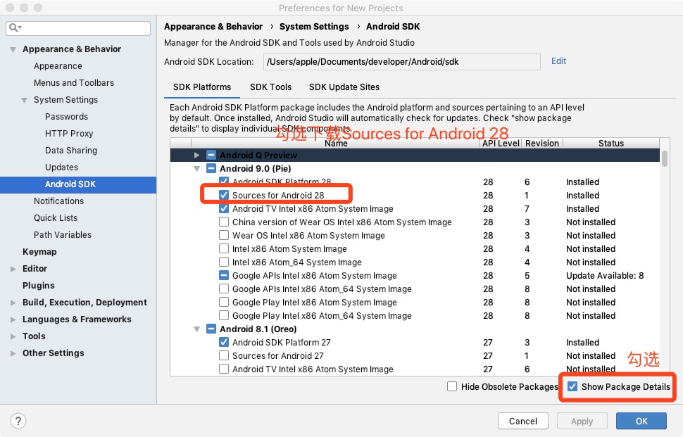
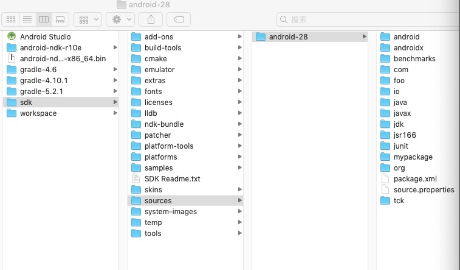
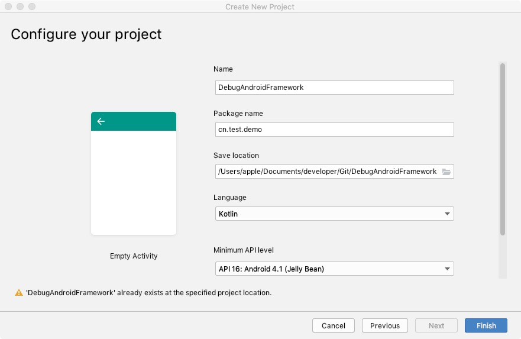
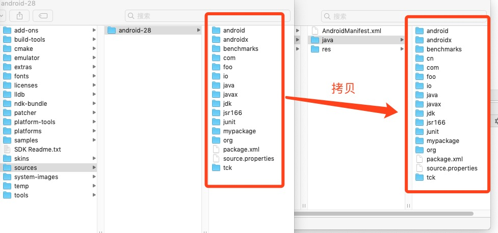
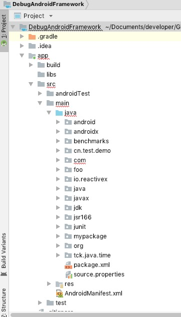
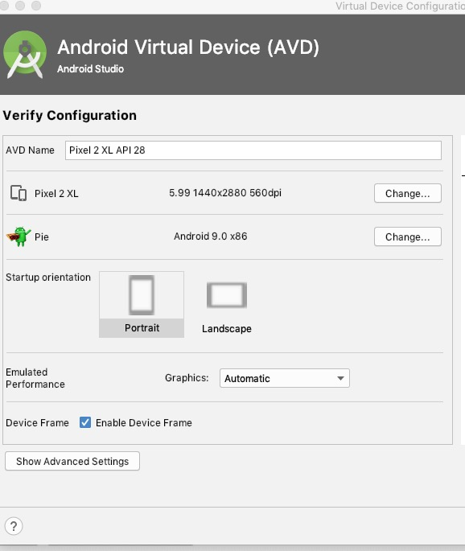
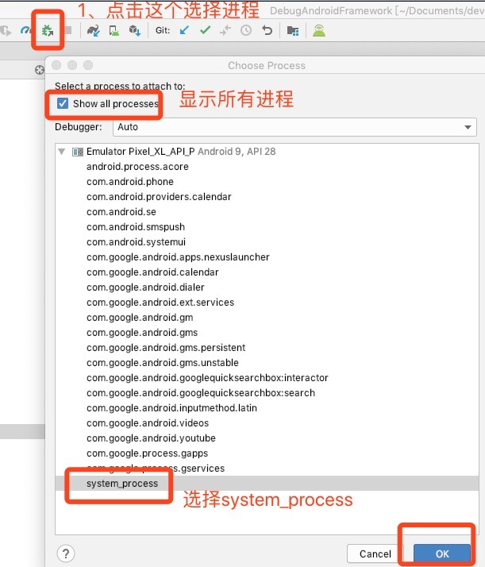
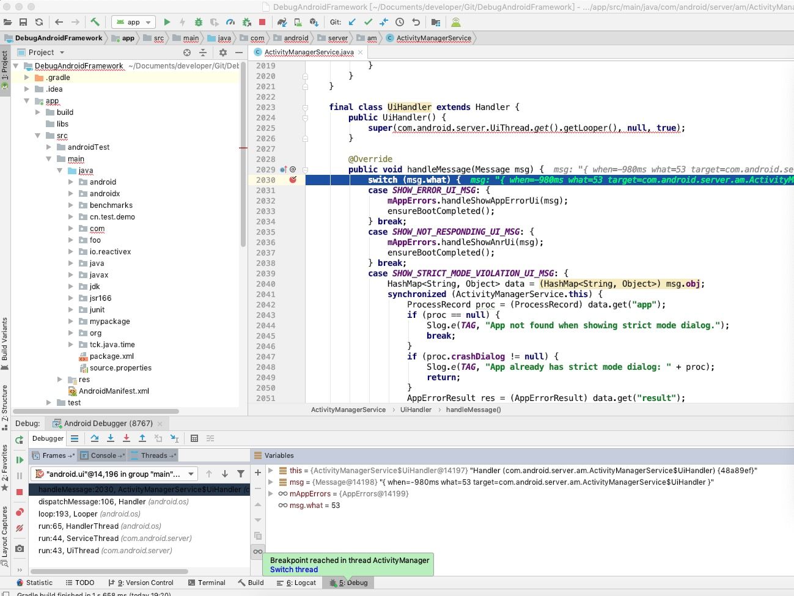

# DebugAndroidFramework

说明：调试Android Framework的Java部分代码，以调试源码android-28为例，需要一个API 28的模拟器配合使用。

一、下载源码

下载源码方式很多，由于调试Framework只需要java代码即可，这里使用Android Studio的SDK Manager下载，以下载android-28为例

下载完后，在sdk/sources下看到android-28源码

二、新建一个项目

包名cn.test.demo，避免com开头是因为源码有com，等下拷贝源码是避免重复

三、拷贝源码到项目的java目录下

可以看到项目目录结构

四、新建一个与源码对应的模拟器

五、启动模拟器，选择debug的进程

六、选择某一个源码类进行调试

如选择ActivityManagerService的子类UiHandler，handleMessage方法后，在模拟器随便点击启动应用，如短信，即可调试

更多请参考[极客时间-Android开发高手课](https://time.geekbang.org/column/article/85425)

